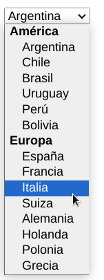
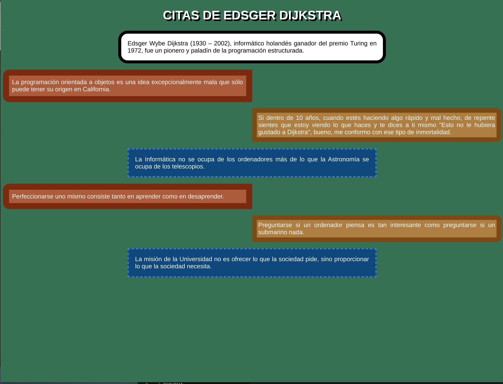
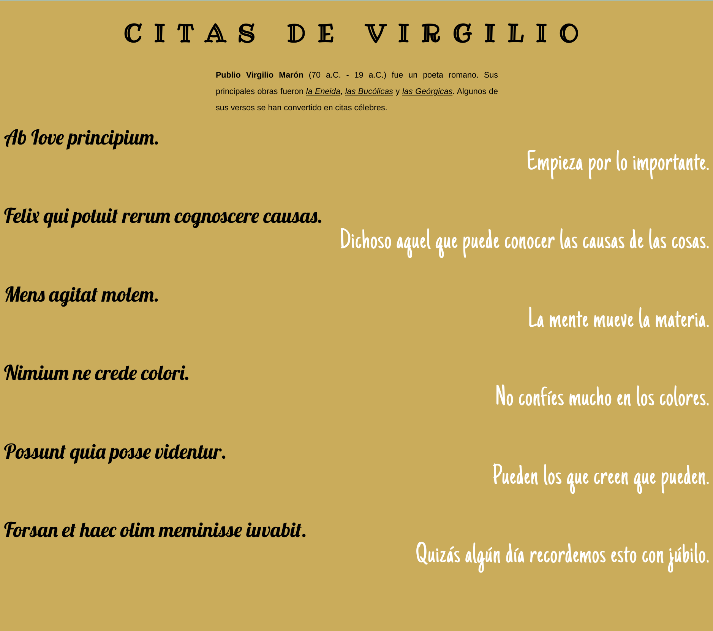
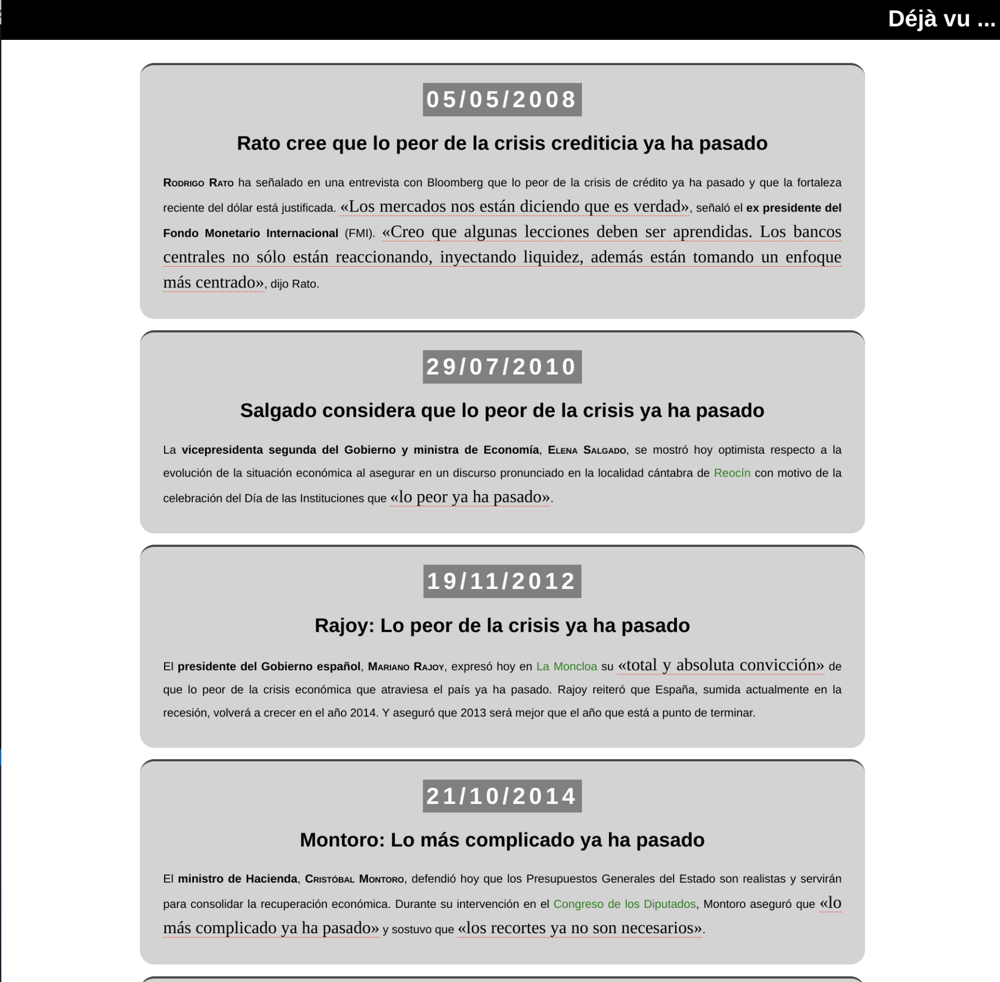

# Ejercicios Repaso HTML 5 & CSS3

% Diseño de Interfaces Web %
% Autor: Marina Vega Vázquez %

- [Ejercicios Repaso HTML 5 \& CSS3](#ejercicios-repaso-html-5--css3)
  - [Objetivo](#objetivo)
  - [Instrucciones](#instrucciones)
  - [Ejercicios solo html](#ejercicios-solo-html)
    - [Ejercicio 1](#ejercicio-1)
    - [Ejercicio 2](#ejercicio-2)
    - [Ejercicio 3](#ejercicio-3)
    - [Ejercicio 4](#ejercicio-4)
    - [Ejercicio 5](#ejercicio-5)
    - [Ejercicio 6](#ejercicio-6)
    - [Ejercicio 7](#ejercicio-7)
    - [Ejercicio 8](#ejercicio-8)
    - [Ejercicio 9](#ejercicio-9)
    - [Ejercicio 10](#ejercicio-10)
    - [Ejercicio 11](#ejercicio-11)
    - [Ejercicio 12](#ejercicio-12)
    - [Ejercicio 13](#ejercicio-13)
  - [Ejercicios de html y css](#ejercicios-de-html-y-css)
    - [Ejercicio 14](#ejercicio-14)
    - [Ejercicio 15](#ejercicio-15)
    - [Ejercicio 16](#ejercicio-16)
    - [Ejercicio 17](#ejercicio-17)
    - [Ejercicio 18](#ejercicio-18)
    - [Ejercicio 19](#ejercicio-19)
    - [Ejercicio 20](#ejercicio-20)
    - [Ejercicio 21](#ejercicio-21)

## Objetivo

Repasar el uso de html5 y css3, corrigiendo problemas de mal uso de los mismos.

## Instrucciones

En todo momento se tiene que usar las etiquetas adecuadas de html5 y las reglas más adecuadas de css 3.

Hasta que se indique lo contrario usa solo html.

## Ejercicios solo html

### Ejercicio 1

Crea una página web para crear una lista de lenguajes de programación.

- Añade un título a la página.
- Confeccionar una lista no ordenada de lenguajes de programación. Luego disponer una lista ordenada con hipervínculos a sitios que tratan dichos lenguajes.

### Ejercicio 2

Crea una página web con el horario de clases. Por ahora emplea solo html, ten en cuenta los atributos: colspan y rowspan. Emplea las etiquetas para indicar la cabecera, pon un título a la tabla.

### Ejercicio 3

Confeccionar una tabla que muestre en la primer columna los nombre de distintos empleados de una compañía y el la segunda el sueldo bruto (la compañía tiene 4 empleados) Disponer en la tabla un título representativo.

### Ejercicio 4

Confeccionar un formulario que solicite el ingreso del nombre de un usuario y su clave. Mostrar asteriscos donde se ingresa la clave. Dispón dos botones, uno para el envío de datos al servidor y otro para borrar el contenido de todos los controles (editores de texto) que contiene el formulario.

### Ejercicio 5

Partiendo del ejercicio 1, añade tras el listado de lenguajes de programación un formulario que solicite el ingreso del nombre de una persona y 4 elementos de tipo checkbox para que seleccione los lenguajes de programación que conoce.

### Ejercicio 6

Añada al formulario anterior una lista para la selección del editor de código preferido.

### Ejercicio 7

- Confeccionar un formulario que solicite los datos personales de una persona y los datos del lugar donde trabaja, cada grupo de datos disponerlos agrupados con su correspondiente legend.
- Debes tener una campo para la fecha de nacimiento.
- Usa una lista con agrupación de de opciones para el país de nacimiento.

### Ejercicio 8

Crea una página web para tu curriculum vitae

Información a incluir

- Cabecera con el texto "Currículum Vitae".
- Debajo de la cabecera una imagen con tu foto (máximo 300x300).
- Datos personales (nombre, apellidos, dirección, teléfono, correo electrónico): Utiliza una lista de definición para mostrar los datos. Incluye una fotografía personal de tipo carnet.
- Formación académica (estudios y cursos realizados): Utiliza una lista no ordenada para mostrar los datos.
- Experiencia laboral (de cada trabajo incluir el período en el que se ha estado, el nombre de la empresa y las funciones realizadas): Utiliza una lista ordenada para mostrar los datos desde el más actual al más antiguo.
- Otros datos de interés (disponibilidad de incorporación, vehículo propio, enlace a su blog personal, etc.): Utiliza párrafos para mostrar los datos.

Además, debe cumplir los siguientes requisitos:

- Establece el charset (Codificación de caracteres) a UTF-8 dentro del "head" del documento.
- Las imágenes que utilices deben estar descargadas en tu ordenador, no debes enlazarlas directamente desde Internet.
- Cada apartado debe estar separado empleando el elemento html más adecuado para el tipo de contenido (article, aside, section, div)
- Los títulos de cada apartado de datos deben mostrarse con la etiqueta adecuada.

### Ejercicio 9

Partiendo del ejercicio anterior:

- Dentro de la cabecera, debajo del título, incluye un menú que nos debe llevar a cada apartado.
- Al final de cada apartado incluir un enlace con el texto Ir a inicio que nos lleve a la cabecera.

### Ejercicio 10

Crea una página para un períodico local.

- Utiliza [canva](https://www.canva.com/es_es/) para crear un logo para el periódico.
- En la cabecera deberás tener el logo y el nombre del periódico en la misma línea.
- Añade en el cuerpo tres artículos periodisticos (emplea la etiqueta adecuada), puedes usar lorem para rellenar el texto.
- Cada artículo tendrá su título y una imagen.
- En el pie coloca información sobre el periódico como: dirección, telefono y email. Emplea las etiquetas más adecuadas.

### Ejercicio 11

En nuestro periódico hemos añadido una sección de comentarios de los lectores, añade 5 comentarios empleando las etiquetas html adecuadas.

### Ejercicio 12

Vamos a crear la página web de una asociación de amantes del ciclismo, la página debe tener:

- Cabecera con el nombre de la asociación y un icono/logo de una bicicleta.
- Un menú con los apartados: Nosotros, rutas, tienda, contacta. Cada apartado, salvo nosotros, será una página web.
- Añade un pie con los datos de la asociación y los enaces a las redes sociales.

Contenido de cada apartado:

- **Nosotros** - contendrá una imagen significativa y un texto sobre una explicación de la asociación. Este será el conenido de la página principal.
- **Rutas** - Se trata de una lista de las rutas que podemos seguir.
- **Tienda** - Esta página será un merchandising sobre productos de la asociación (camisetas, gorras, pines, tazas,...). Para crear esta página debes añadir cada producto en una caja (emplea la etiqueta adecuada) que contendrá una imagen de tamáño máximo de 200x200 un nombre de producto y un precio.
- **Contacta** - pequeño formulario con los campos: nombre, email, campo de texto para escribir y un botón de enviar.

### Ejercicio 13

Partiendo del curriculum vitae:

Añade un pie de página con lo siguiente:

- El símbolo de copyright junto con tu nombre y apellidos.
- Una lista con enlaces a tus redes sociales, donde el enlace será un icono.
  
De donde sacar los iconos:

- [faticon](https://www.flaticon.es/iconos-gratis/creative-commons)
- [iconos8](https://iconos8.es/icons/set/creative-commons)
- [icons-icons](https://icon-icons.com/es/buscar/iconos/creative+commons)

## Ejercicios de html y css

>***Desde este ejercicio usa html con css***

### Ejercicio 14

Definir un estilo diferente para los elementos h1,h2,h3,h4,h5 y h6. Mostrar mensajes utilizando estos elementos a las que se le han definido estilos: fuente, color de texto y fondo. Especifica los estilos a nivel de la página html.

### Ejercicio 15

> Ejercicio de bordes.

Parte de la página html que encontrarás en la carpeta [plantillas](./Plantillas/Bordes/) para la realización de la siguiente página. Emplea las etiquetas: header y main.

Completa o modifica el html para que emplee html5 y añáde una hoja de estilos externa dentro de una carpeta llamada src.

Especificaciones:

- Fuente del texto: sans-serf tamaño de 1.25rem.
- Color fondo: rgb(38,115,82).
- Sombra del título: negra de 5px de desplazamiento del eje X e Y.
- Reglas del párrafo de introducción:
  - Boder de 10px negro.
  - margen derecho e izquierdo del 25%. ¿De que otra forma se puede hacer que este párrafo se coloque en esa misma posición de la página?
  - relleño de 20px.
- Reglas del párrafo de la izquierda:
  - Boder de 20px de color rgb(128, 36, 0).
  - margen derecho de 50%.
  - Borde superior derecho e izquierdo de 20px.
  - Relleno 10px.
  - color de fondo rgb(179, 87, 51).
- Reglas del párrafo de la derecha:
  - Boder de 15px de color rgb(128, 72, 0).
  - margen izquierdo de 50%.
  - Borde superior derecho e izquierdo de 15px.
  - Relleno 5px.
  - color de fondo rgb(179, 123, 51).
- Reglas del párrafo del centro:
  - Boder de 5px de color rgb(51, 121, 179).
  - margen izquierdo y derecho de 25%.
  - Borde superior derecho e izquierdo de 15px.
  - Relleno 20px.
  - color de fondo rgb(0, 70, 128).

.

### Ejercicio 16

> Ejercicio de Fuentes locales.

Parte de la página html que encontrarás en la carpeta [plantillas](./Plantillas/Fuentes/) para la realización de la siguiente página. Emplea las etiquetas: header y main.

Completa o modifica el html para que emplee html5 y añáde una hoja de estilos externa dentro de una carpeta llamada src.

Etiquetas:

- Cada cita se encuentra en un párrafo.
- Se usa strong para el nombre del escritor.
- Par poner el nombre de las obras en cursiva usamos la etiqueta cite.

Especificaciones:

- En este ejercicio se utilizará la regla-arroba @font-face, para enlazar las siguientes fuentes en nuestro propio ordenador (descargalas de [Google Fonts](https://fonts.google.com/)):
  - Título: Ribeye Marrow y cursive.
  - Citas en latin: Lobster y sans-serif
  - Citas en castellano: Just Another Hand y sans-serif.
- Tamaño fuentes:
  - h1: 3rem.
  - Texto en latin: 2.5rem.
  - Texto en castellano: 3.5rem. Espaciado entre letras 1px.
- Reglas para el primer párrafo:
  - Interlineado de 200%.
  - Margen derecho e izquierdo de 30%.
  - Texto justificado.
- Reglas para los párrafos en castellano.
  - Margen arriba de 0, en la horizontal de 0 y abajo de 3rem.
  - Texto alineado a la derecha.

.

### Ejercicio 17

> Ejercicio de Fuentes enlazadas a [Google Fonts](https://fonts.google.com/).

Copia la solución anterior empleando esta vez "@import" para importar las fuentes de Google Fonts.

### Ejercicio 18

> Ejercicio de texto.

Parte de la página html que encontrarás en la carpeta [plantillas](./Plantillas/Fuentes/) para la realización de la siguiente página. Emplea las etiquetas: header y main.

Completa o modifica el html para que emplee html5 y añáde una hoja de estilos externa dentro de una carpeta llamada src.

Etiquetas:

- "Déjà vu" es el título de la página y está en la cabecera.
- Cada cita con su fecha y el texto que lo acompaña están dentro de un elemento article.
- Empleamos la etiqueta "time" para poder indicar la fecha en un formato más legible para los buscadores, añadiendo el atributo datetime. El valor del atributo puede seguir el formato AAAA-MM-DD y se hará coincidir con el valor contenido por cada etiqueta.
- Empleamos span en el cargo y el lugare.
- Empleamos strong para indicar el autor de la cita.
- Al tratarse de citas cortas empleamos la etiqueta q.

Especificaciones:

- Fuente de partida 16px sans-serif. Texto justificado.
- Relleno del h1 10px.
- Etiqueta h2 fuente 1.7rem.
- Para los article:
  - Color fondo lighgray.
  - Ancho máximo de 70%.
  - Borde redondeado de 20px.
  - Borde superior 3px rgba(0,0,0.0.674).
  - Interlineado 2rem.
  - Relleno de 1rem.
  - Margen inferior de 1rem.
- Margen de 1rem para los párrafos.
- Para la fecha:
  - Relleno de 5px.
  - Color de fondo gray.
  - Fuente 200%.
  - Negrita.
  - Espaciado entre letras 5px.
- Para los strong: fuente de tipo small-caps.
- Para las citas:
  - borde inferior discontinuo rojo de 1px.
  - Fuente serif de 1.5rem.
- Para los span de cargo: negrita.
- Para los span de lugar color verde.

.

### Ejercicio 19

Partiendo del html del currículum vitae:

- Centra el texto de la cabecera.
- El main no debe ocupar más del 80% de la página.
- Coloca tu foto a la izquierda de la página, con el borde redondeado de forma que quede como un círculo.
- Para separar cada apartado coloca una línea inferior de color gris en todos los apartados menos en el último.

### Ejercicio 20

Formatea el periódico local con css a tu gusto.

### Ejercicio 21

Formatea las hojas de la asociación ciclística con css a tu gusto.
