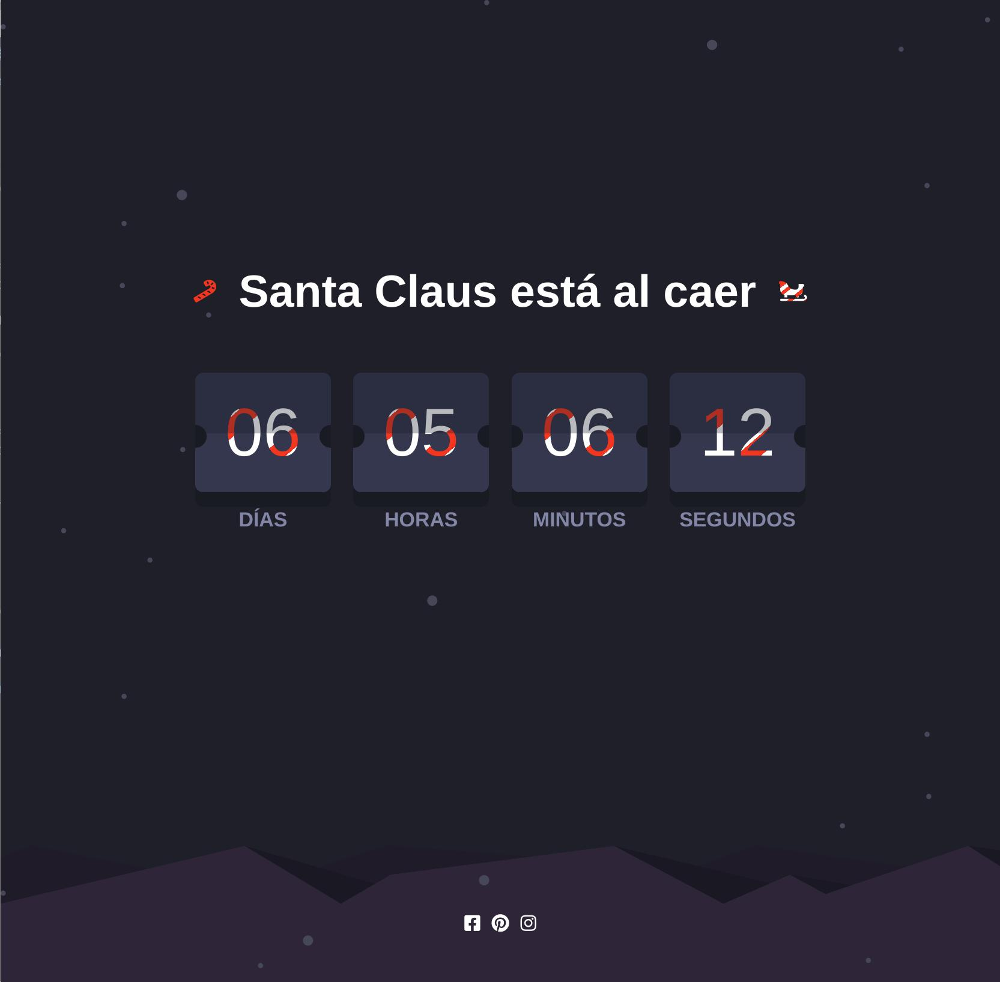
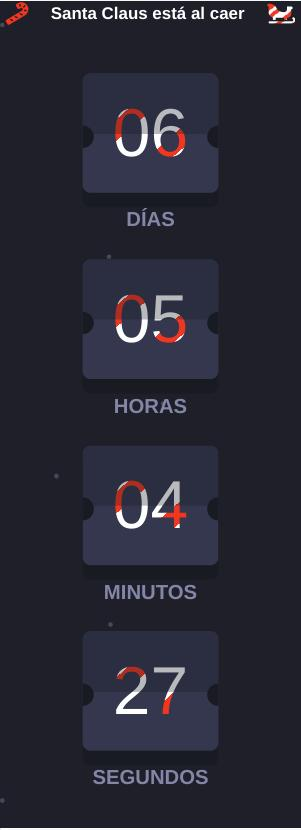

# Reto - Cuenta atrás de navidad 🎉

**Realizado por Marina vega**
**Basado en los retos de Frontend Mentor**

## Table of contents

- [Reto - Cuenta atrás de navidad 🎉](#reto---cuenta-atrás-de-navidad-)
  - [Table of contents](#table-of-contents)
  - [Reto](#reto)
    - [Built with](#built-with)
    - [Construido con](#construido-con)
    - [Diseños](#diseños)

## Reto

Vamos a crear una cuenta atras para el día de navidad, para ello emplearemos flexbox para ajustar las cards de los números. Simularemos un reloj donde los números son unas tarjetas que caen.

Los diseñadores deben ser capaces de:

- Crear un diseño responsive.
- Crear una cuenta atrás en tiempo real que se agota cada segundo.
- **Bonus**: Cuando un número cambia, hacer que la tarjeta de la vuelta del centro

### Built with

### Construido con

- HTML5 semántico
- Propiedades CSS personalizadas
- Flexbox
- Flujo de trabajo mobile-first
- Javascript para el cronómetro.

### Diseños

- 
- 
- 
